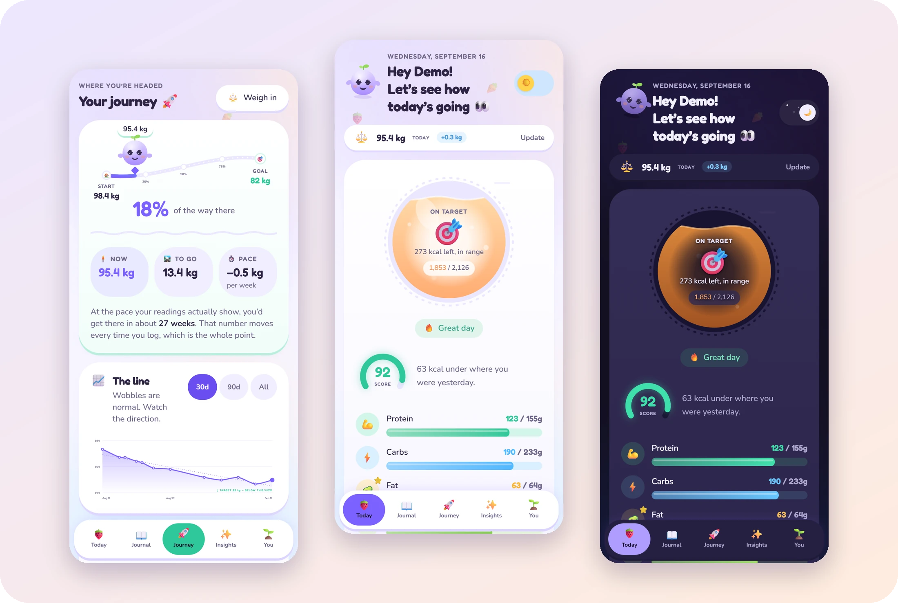
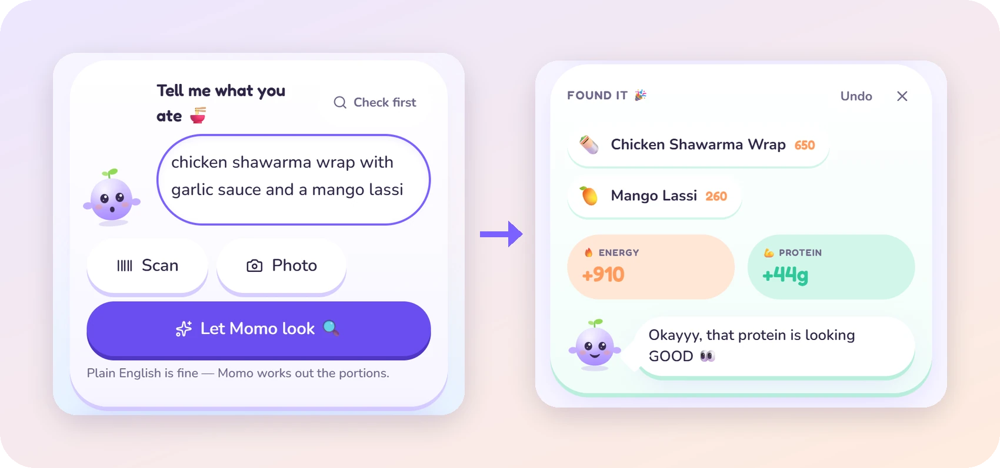
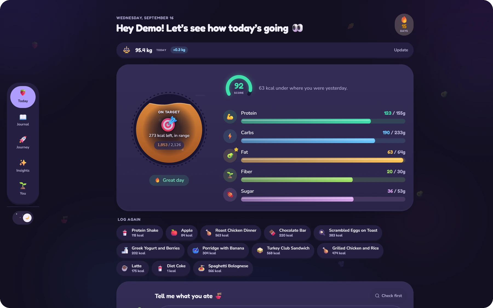
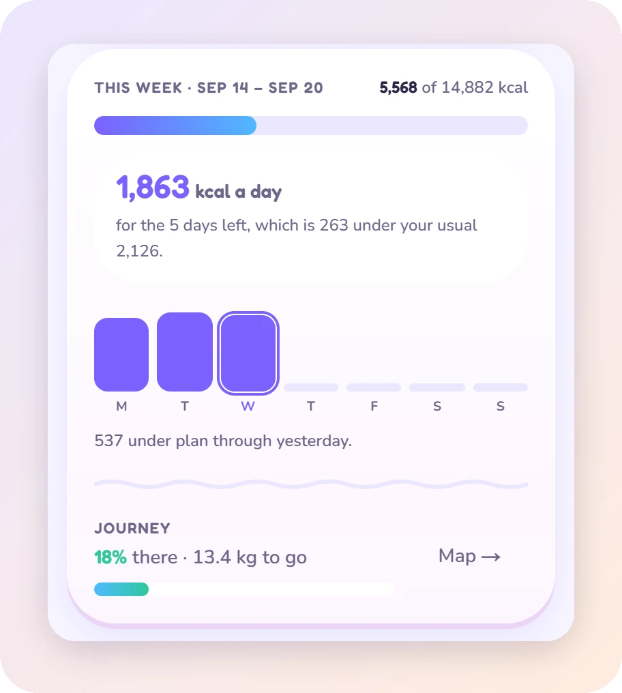
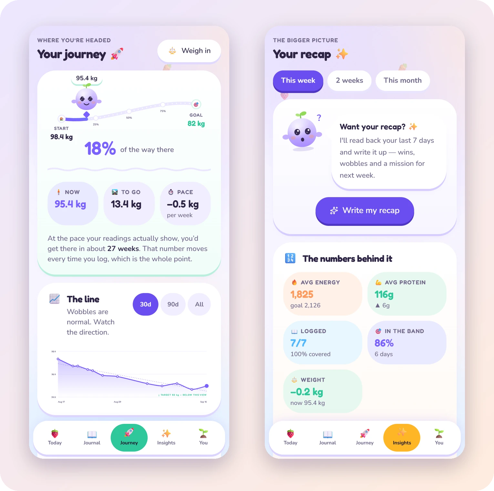
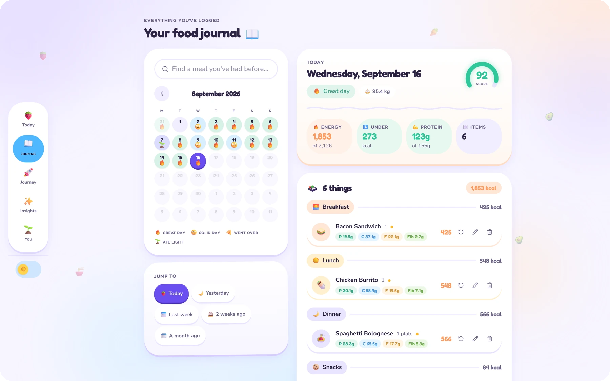
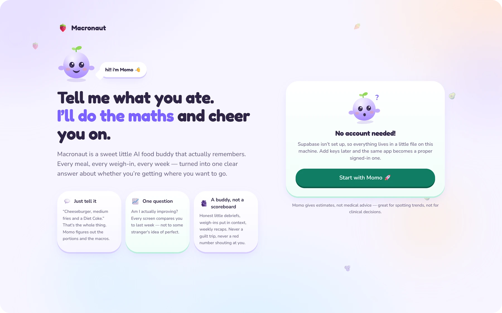

<p align="center">
  
</p>

<h1 align="center">Macronaut</h1>

<p align="center">
  <b>Tell it what you ate. It does the maths — and answers the only question that matters:<br>
  <i>am I actually improving?</i></b>
</p>

<p align="center">
  <a href="https://macronaut-lemon.vercel.app"><b>Open the app</b></a>
  &nbsp;·&nbsp;
  <a href="#run-it-in-a-minute">Run it locally</a>
  &nbsp;·&nbsp;
  <a href="#how-its-built">How it's built</a>
</p>

<p align="center">
  
  
  
  
  
  
  
</p>

---

Macronaut is an AI calorie and macro tracker you can install on your phone. You describe a
meal in plain English, snap a photo or scan a barcode, and it keeps the long record — food,
weight, goals and trends — so the numbers add up to an answer rather than a spreadsheet.

It is deliberately not another logging chore. It is a bright little world with a mascot
called **Momo**, an AI coach that is honest without ever scolding, and a score that dents on
a heavy day but never flattens it.

## Log a meal the way you'd say it

<p align="center">
  
</p>

- **Type it.** Portions, brands and "a handful of" are all fine. Each food comes back
  itemised with calories, protein, carbs, fat, fiber and sugar, plus any assumptions made.
- **Photograph it.** Momo reads packaging before guessing. When a photo is genuinely
  ambiguous — a part-full glass of something dark could be cola or coffee — it commits to
  its best guess and keeps the runner-ups as one-tap swaps, with no second AI call.
- **Scan a barcode.** Exact label data from [Open Food Facts](https://world.openfoodfacts.org).
  Uses the browser's native `BarcodeDetector` where it exists and a bundled ZXing decoder
  everywhere else, so iPhones get a real scanner rather than a number pad.
- **Check first.** Ask what something would do to your day before you commit to it.
- **Fix anything.** Edit any number, undo a log, repeat a favourite in one tap. Corrections
  are remembered and applied next time.

## Today, at a glance

<p align="center">
  
</p>

The energy jar fills as you eat and sloshes while it does. Meters track protein, carbs, fat,
fiber and sugar against your plan, and each day gets a score out of 100 with a debrief
from Momo underneath. Light and dark are both designed, not inverted.

## A week is one budget, not seven verdicts



A heavy Saturday is only a problem if the rest of the week doesn't absorb it, and a daily
target can't tell you that. So Today also shows the week as a single budget — and turns
what's left into the number you actually act on: **what the remaining days can average**.

It sums each day's *own* target rather than multiplying today's, because a weigh-in can
change your plan mid-week. Days you didn't log are flagged instead of quietly counted as
zero calories.

<br clear="right">

## Is it working?

<p align="center">
  
</p>

- **Journey** draws your weight as a road with Momo standing where you are, a trend line,
  and an arrival estimate based on the pace your readings actually show.
- **Insights** compares this week, fortnight or month against the one before, and writes
  an AI recap: wins, wobbles and one mission for next week.
- **Weigh-ins re-target your plan.** The intake that produces a given weekly loss falls as
  you get lighter, so each new reading quietly updates your targets from that day forward.
- Streaks, a sticker book of achievements, and where your sugar actually came from.

## Every day, kept

<p align="center">
  
</p>

A calendar marks how each day went. Reopen any past day and it is scored against **the plan
that was in force then** — changing your goal today never rewrites what last month meant.
Search everything you've ever logged, and backfill a missed meal on any day.

## Runs with zero configuration

<p align="center">
  
</p>

Clone it and run it with no keys at all. Every missing service degrades to something that
still works:

| Not configured | What you get instead |
| --- | --- |
| Supabase | **Solo mode** — one local user, no sign-in, data in a JSON file |
| Gemini | A built-in food estimator and template coaching, until someone adds their own key |
| Push keys | Everything except reminders |

Add keys later and the same app upgrades in place.

## And also

- **Installable PWA** with its own icon, launcher shortcuts and an offline screen.
- **Offline outbox.** Log without signal and the meal is held in IndexedDB until you're back.
- **Swipe between tabs** on touch devices; tap the tab you're on to jump back to the top.
- **Daily reminders** by web push, sent at the hour you choose in *your* time zone.
- **Export everything** as JSON, or your food and weight logs as CSV.
- **Respects reduced motion** — every animation settles to a resting pose.

---

## Run it in a minute

Requires Node 20.9 or newer.

```bash
git clone https://github.com/UmaisNisar/macronaut.git
cd macronaut
npm install
npm run dev
```

Open <http://localhost:3000>. With no environment variables it starts in solo mode.

Want something to look at? Go to **You → Data → Load demo history** to generate about six
weeks of realistic meals and weigh-ins (development only).

## Configuration

Copy the template and fill in only what you want:

```bash
cp .env.example .env.local
```

| Variable | Needed for |
| --- | --- |
| `GEMINI_API_KEY` | The server's own AI key. In solo mode it powers everything; with accounts it only serves the emails in `MACRONAUT_AI_PRIORITY_EMAILS` (see below). [Get a free key](https://aistudio.google.com/apikey). |
| `MACRONAUT_ENCRYPTION_KEY` | Encrypts the Gemini keys people save. Required with accounts; any long random string (`openssl rand -base64 32`). Changing it means everyone re-adds their key. |
| `MACRONAUT_AI_PRIORITY_EMAILS` | Accounts allowed to use the server's key — usually just yours |
| `MACRONAUT_SHARE_SERVER_KEY` | Set to `true` to let every account use the server's key (a private deployment for friends) |
| `NEXT_PUBLIC_SUPABASE_URL`, `NEXT_PUBLIC_SUPABASE_ANON_KEY` | Accounts and a real database |
| `SUPABASE_SERVICE_ROLE_KEY` | The reminder job and account deletion (never sent to the browser) |
| `NEXT_PUBLIC_VAPID_PUBLIC_KEY`, `VAPID_PRIVATE_KEY`, `VAPID_SUBJECT` | Push reminders |
| `CRON_SECRET` | Protects the reminder endpoint |
| `MACRONAUT_AI_GLOBAL_DAILY_LIMIT` | Optional cap on calls made on the server's key per day (default 400) |

Everything else in `.env.example` is optional and documented there.

### Everyone brings their own Gemini key

With accounts switched on, the deployment's Gemini key is **not** shared with strangers.
Onboarding asks each person for their own free key from Google AI Studio, checks it with
Google, and stores it encrypted (AES-256-GCM, bound to their account). Their meals, photos and
notes then run on their quota, not yours. People can skip the step — the app falls back to
its built-in estimator — and add, replace or remove the key later under **You → Momo's AI**.

Your own account keeps using the server's key if its email is in
`MACRONAUT_AI_PRIORITY_EMAILS`.

### Supabase

```bash
npx supabase login
npx supabase link --project-ref <your-project-ref>
npx supabase db push            # applies supabase/migrations/
```

The migrations create every table with row-level security scoping each row to its owner.
Email confirmation is on by default, so the first sign-up needs a click in your inbox.

> [!TIP]
> Running a personal copy? Once your own account exists, turn off **Authentication → Allow
> new users to sign up** so nobody else can create an account on your project.

### Google sign-in

1. In **Google Cloud Console → APIs & Services → Credentials**, create an OAuth client ID
   (Web application) with this authorised redirect URI:

   ```
   https://<your-project-ref>.supabase.co/auth/v1/callback
   ```

2. In **Supabase → Authentication → Sign In / Providers → Google**, paste the client ID and
   secret, then add your site's `/auth/callback` URL (and `http://localhost:3000/auth/callback`)
   under **URL Configuration**.

Alternatively, [`supabase/config.toml`](supabase/config.toml) declares all of this:

```bash
GOOGLE_OAUTH_CLIENT_ID=... GOOGLE_OAUTH_SECRET=... npx supabase config push
```

> [!WARNING]
> `config push` applies the **whole file** immediately. Any setting it doesn't mention
> reverts to the CLI's default, which isn't always the hosted default. Read the diff it
> prints before confirming.

### Push reminders

```bash
npx web-push generate-vapid-keys
```

Put the pair in the VAPID variables, set `CRON_SECRET`, and schedule an **hourly** request
to `/api/cron/reminders`. Each run sends only to people whose chosen hour it currently is in
their own time zone. Vercel Cron attaches `Authorization: Bearer <CRON_SECRET>` automatically;
any other scheduler must send the same header.

### Deploying

Macronaut deploys to Vercel as a standard Next.js app — import the repository, add the
environment variables above, and deploy. The service worker only registers over HTTPS or on
`localhost`, so a phone on your LAN won't be offered the install prompt.

---

## How it's built

| Layer | Choice |
| --- | --- |
| Framework | Next.js 16 (App Router, Server Actions, Turbopack), React 19 |
| Language | TypeScript, with Zod 4 at every boundary |
| UI | Tailwind CSS 4, Base UI primitives, Motion — and every chart hand-drawn in SVG |
| Data | Supabase (Postgres, Auth, row-level security), or a local JSON store |
| AI | Google Gemini with structured output and a model fallback chain |
| Scanning | Native `BarcodeDetector`, ZXing fallback, Open Food Facts |
| Tests | Vitest for units, Playwright across Chrome **and** WebKit end to end |

```
src/
  app/
    (app)/          today · history · progress · insights · profile — the signed-in shell
    welcome/        landing and sign-in
    onboarding/     first-run setup with a live plan preview
    api/            cron reminders · export · client error reports · connectivity ping · dev seed
  components/
    mascot/         Momo, and the speech bubble it talks through
    viz/            energy jar · macro meters · journey road · charts
    today/  history/  weight/  insights/  profile/  onboarding/  shell/
    ui/             restyled Base UI primitives
  lib/
    schemas.ts      every Zod schema, including the AI output contracts
    nutrition.ts    BMR and TDEE, targets, day scoring, journey maths
    insights.ts     period comparisons, streaks, the weekly budget
    ai/             Gemini client · prompts · food and photo analysis · coaching · offline estimator
    db/             one store interface, with Supabase and local JSON drivers
    supabase/       server and admin clients, retrying transient failures
  server/
    actions.ts      every Server Action
    core.ts         day recomputation, goal snapshots, achievements
  proxy.ts          session refresh and a per-request nonce CSP
```

<details>
<summary><b>One store, two drivers</b></summary>

`DataStore` in `lib/db/store.ts` is the only thing the app talks to. `supabase.ts` implements
it over Postgres; `local.ts` implements it over a JSON file with a write lock. Nothing above
that layer knows which is running, which is what makes solo mode a real mode rather than a
demo.
</details>

<details>
<summary><b>History is never rewritten</b></summary>

Targets are **versioned, not overwritten**. Every plan change — including the automatic one
after a weigh-in — writes a goal snapshot effective from that day, and every past day is
scored against the snapshot in force at the time.

Days are **rollups**. Food entries are the source of truth; daily logs hold the recomputed
totals, score and coach note. Anything that changes food recomputes its day, so the two
can't drift apart.
</details>

<details>
<summary><b>The AI layer</b></summary>

Separate prompts and separate Zod contracts for each job: analysing text, analysing photos,
the daily debrief, weigh-in context, and period reports.

- Every call sends a Gemini response schema **and** validates the reply with Zod. Nothing the
  model returns reaches the database unchecked.
- On any failure — no key, rate limit, malformed output — it falls back to the next model in
  the chain, then to the deterministic path. The app keeps working.
- Food analysis reconciles stated calories against the 4/4/9 macro maths and corrects items
  that are well out.
- Context sent to the model is small: aggregates and a day-by-day skeleton, never your full
  history. Reports are cached against a signature of the numbers they were written from.
- Each account's calls go out on its own saved key. The server's key is kept for solo mode
  and the accounts you name, with a global ceiling in case you choose to share it.
- A key Google refuses stops the model chain at once and tells the person, instead of trying
  five models with the same broken key.
- Per-account daily limits for each kind of call, including checking a pasted key, so the
  check can't be used to test stolen ones.
</details>

<details>
<summary><b>Scoring</b></summary>

Out of 100, and deliberately forgiving:

| Weight | For |
| --- | --- |
| 45 | Energy — full marks anywhere from 85% to 105% of target, easing off gently either side |
| 30 | Protein against target |
| 15 | Logging the day |
| 10 | Fiber against target |

A day is **Great** at 82+, **Solid** at 64+, and otherwise *above target* or *under-fuelled*
depending on which side it fell. Nothing in the app tells you that you failed.
</details>

<details>
<summary><b>Security and reliability</b></summary>

- A strict Content Security Policy with a fresh nonce per request, issued from `proxy.ts`.
- Row-level security on every table; the service-role key is used only on the server, for the
  reminder job and for deleting an account.
- Saved Gemini keys are encrypted with a secret that exists only in the deployment's
  environment, sent to Google in a header rather than a URL, and never returned to the page —
  only their last four characters.
- A plain-language [privacy page](src/app/privacy/page.tsx), data export, and a real
  *Delete my account* that removes the sign-in as well as the data.
- The reminder endpoint fails closed without its secret, and the demo-data route refuses to
  run in production.
- Server and client errors land in the app's own database table rather than a third-party
  service, so health diagnostics stay inside the same trust boundary as health data.
- Reads retry through transient database failures. Writes deliberately don't: a timed-out
  insert may already have committed, and replaying it would log the same meal twice.
</details>

## Testing

```bash
npm test            # unit tests (Vitest)
npm run test:e2e    # end-to-end suite (Playwright)
npm run lint
```

The end-to-end suite builds its own solo-mode copy of the app, so it runs without keys or
network, then drives it in **Chrome and WebKit** — WebKit being the engine every iPhone
browser uses. It launches your installed Google Chrome rather than a bundled Chromium, and
needs WebKit installed once with `npx playwright install webkit`.

Beyond flows, it guards things that are easy to break without noticing: contrast on every
filled control in dark mode, that animations are still running, that the navigation pill
sits on the right tab, that barcodes decode in WebKit, and that nothing on screen is
narrower than its own label.

---

<sub>Calorie and macro figures are estimates. They're good for spotting trends over weeks, not
for clinical decisions — talk to a professional before making big changes, especially with a
health condition.</sub>
